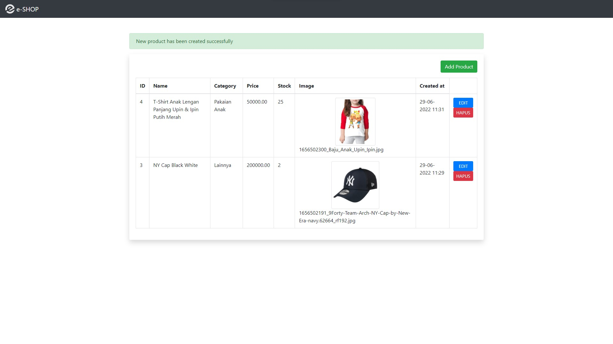
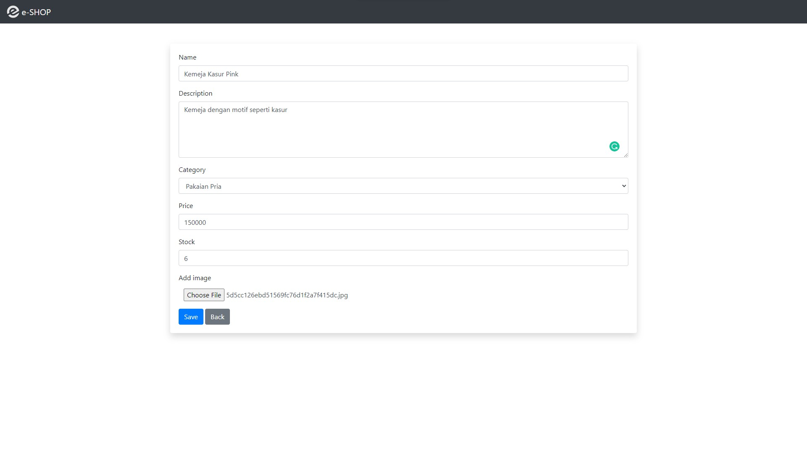
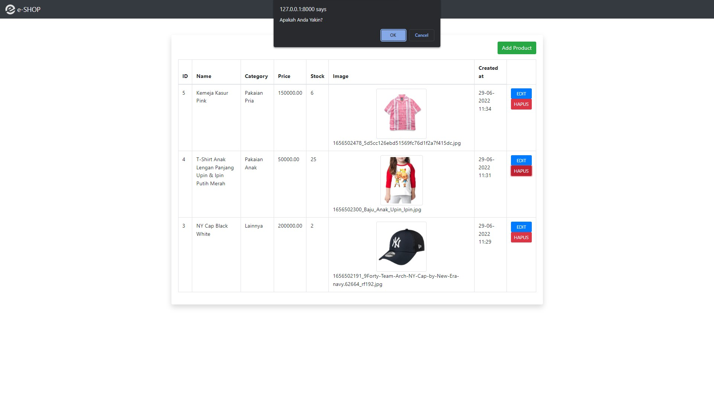
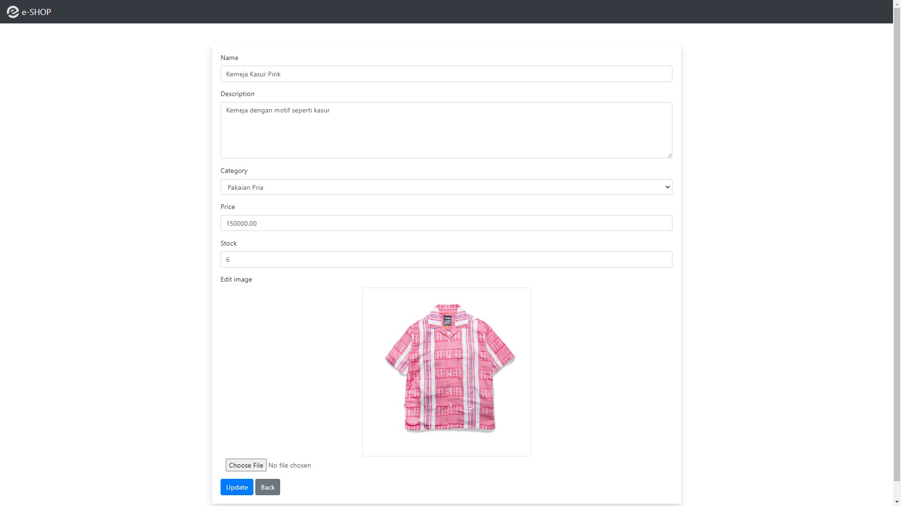

# Final Project Oprec MCI 2022
  
## e-SHOP
e-SHOP adalah website e-commerce yang menjual kebutuhan fashion Anda, seperti pakaian pria, wanita, anak-anak, maupun aksesoris lainnya. Website ini memiliki dashboard yang dapat digunakan oleh admin untuk melihat dan mengatur produk yang dijualnya.

## Fitur Aplikasi
List fitur pada aplikasi ini adalah sebagai berikut.
1. Fitur Dashboard
2. Fitur Add Product
3. Fitur Edit Product
4. Fitur Delete Product

## Tampilan Aplikasi
### Fitur 1: Dashboard

Dashboard digunakan untuk melihat daftar barang yang terdapat di dalam database e-SHOP. Untuk mengakses fitur ini, kita dapat menekan logo e-SHOP yang berada di navbar. Selain itu, dashboard dapat digunakan untuk mengakses fitur-fitur lainnya, seperti Add Product, Edit Product, dan Delete Product.
### Fitur 2: Add Product

Sesuai namanya, fitur ini digunakan untuk menambah produk baru ke database website.
### Fitur 3: Edit Product

Fitur Edit digunakan untuk mengubah data produk yang sebelumnya telah ditambahkan ke dalam database.
### Fitur 4: Delete Product

Fitur terakhir ini adalah fitur yang digunakan untuk menghapus product.
